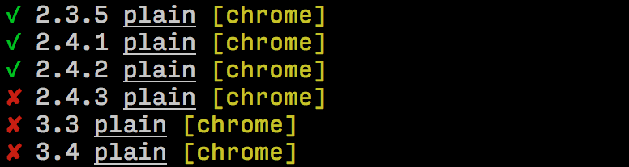

---

layout: sc5

style: |

    #custom {
      background: black;
      padding-top: 0;
    }
    #custom h2 {
      color: yellow;
      margin-top: 70px;
    }
    .code--small {
      font-size: 16px;
    }
---

# Component-focused approach at Passion project {#cover}

Varya Stepanova, <span class="position">Passion UI Team</span>
{:.author}


## Old school UI development
{: .slide--shout .slide--azure }

{: .svg style="width: 200px; height: 200px;" }


## Current status of Passion UI
{: .slide--shout .slide--azure }

{: .svg style="width: 200px; height: 200px;" }

## Front-end at Passion

<div class="double" markdown="1">

### Good

* Well-structured project
* Uses cross-company components (DNA Style Guide)
* Has own reusable components<br/><br/>

### Bad

* *Sometimes* duplicates company components
* There is no-componentized code
* Some components w/o templates

</div>

// Copy-paste across the project
// Non-consistent UI
// No big picture what is implemented


## Components on the web
{: .slide--shout .slide--azure }

{: .svg style="width: 200px; height: 200px;" }

// About the approach in general


## Component thinking

### when developing frontend
{: .subtitle }

* Reusable modules
* Testable and stable


## Componentize!

<div class="triple" markdown="1">

### CSS

* OOCSS
* BEM
* CSS modules

### JavaScript

* AMD, `require`, etc
* Angular
* ReactJS

### NodeJS

* `module.exports`
* npm

</div>


## Brain shift needed
{: .slide--shout .slide--red }

// It's good to have technological options to produce components.
// But usually what we are missing is infrastructure and
// comfortable environment to apply all these technologies.


## SC5 style guide generator
{: .slide--shout .slide--azure }

{: .svg style="width: 200px; height: 200px;" }


## Documenting the components

```
// Button
//
// markup:
// <button class="dna-button" />
//
// Styleguide 5.1

.dna-button {
  background-color: $brand-pink;
  font: ...
}
```
{: .code--small }


## The magic result

* *Auto-generated* documentational website
* Reference for designers, *based on actual code*
* Development playgroud


## Passion documented components
{: .slide--shout .slide--azure }

{: .svg style="width: 200px; height: 200px;" }


## Built from code

### Automatically
{: .subtitle }

```
$ gulp watch
```

Alive and refreshing: [http://localhost:3000](http://localhost:3000)


## Passion component coverage
{: .component-coverage }

<div class="picture">
  <div class="dna-codebase">
  </div>
  <div class="ps-codebase">
  </div>
</div>

### Stay focused

* What we have implemented?
* What we used from common?
* What we could use?
{: .list }

<style>
.component-coverage .picture {
  text-align: center;
  float: left;
  margin-right: 145px;
}
.component-coverage .list {
  margin-left: 460px;
}
.dna-codebase,
.ps-codebase {
  width: 280px;
  height: 280px;
  border: #0c8a8e 5px solid;
  border-radius: 50%;
  display: inline-block;
  margin-right: -75px;
  position:relative;
}
.dna-codebase:before,
.ps-codebase:before {
  display: block;
  position: absolute;
  left: 0;
  bottom: 0;
  margin-bottom: -3em;
  text-align: left;
  white-space: pre;
  line-height: 1.25em;
}
.dna-codebase {
  background: rgba(12, 138, 142, 0.25);
}
.ps-codebase {
  border-color: #871277;
  background: rgba(135, 18, 119, 0.25);
  margin-left: -75px;
}
.dna-codebase:before {
  content: 'common \A components';
}
.ps-codebase:before {
  content: 'project \A components';
  margin-left: 100px;
}
</style>


## Passion Style Guide

<div class="double" markdown="1">

### Common components

1. Atoms
2. Molecules
3. Organisms

### Project components

10. Basics
11. PS Atoms
12. PS Molecules
{: start="10" }

</div>

<style>
ol[start="10"] {
  counter-increment: list +9;
}
</style>


## How to use

* UI documentation<br/>
  *Bridges the gap between designer and developer. Common language across the team.*
* Development playground<br/>
  *Possible develop in isolation and focused on a component*
* Rendered code reference<br/>
  *Perfect for different automations*


## Visual tests
{: .slide--shout .slide--red }

{: .svg style="width: 200px; height: 200px;" }


## General Idea
{: .visual-tests-idea }

### Visual tests
{: .subtitle }

* Every component has its page. We store reference screenshots
* Code changes => Page changes => We take new screenshots and compare

{: .picture }

<style>
.visual-tests-idea .picture {
  width: 400px;
}
</style>


## Spot the difference

```
> gulp test:visual
```



### Human's version: [gemini-report/index.html](gemini-report/index.html)


## Always 100% test coverage!
{: .slide--shout .slide--red }


## Future plans
{: .slide--shout .slide--azure }

{: .svg style="width: 200px; height: 200px;" }


## Future plans

* Use cross-company components
* Component-focused approach when developing
* Maximum code-reusage
* Automation of visual tests


## Thank you!

Varya Stepanova<br/>
*Senior Software Specialist, Passion UI Team & SC5*
